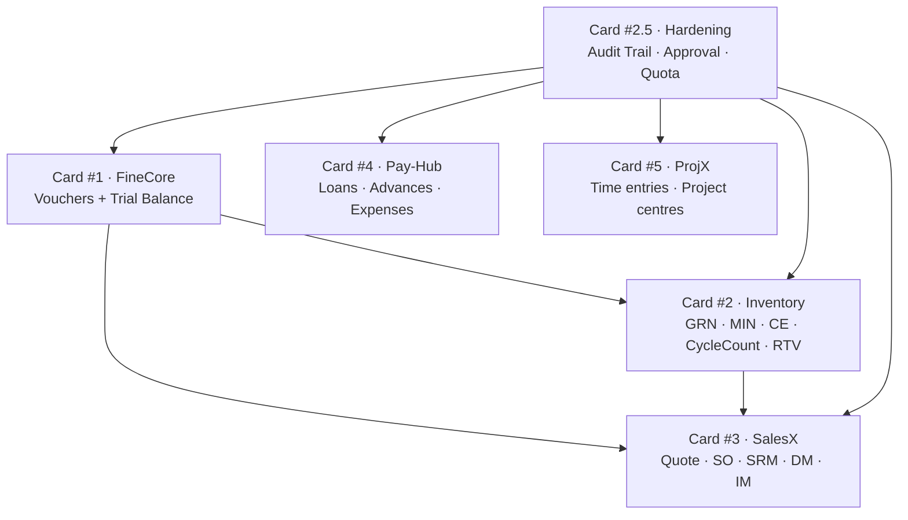
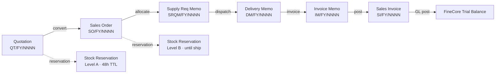
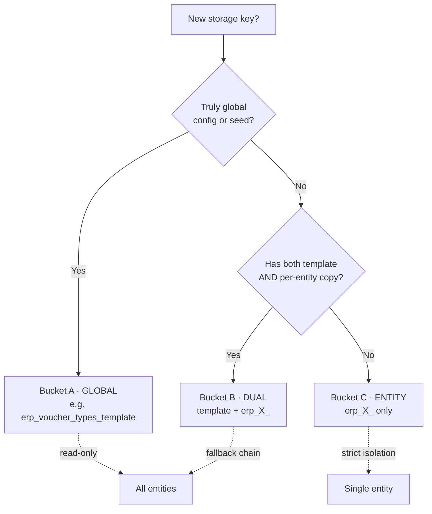
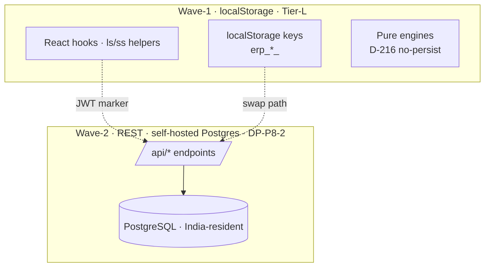

# Operix — Technical Architecture Reference

**Anchor:** Wave-1 freeze · commit `cbe2357` · 187 ⭐ · 14 June 2026
**Role:** The deep technical reference — invariants, data flows, key-scoping, and FK patterns. For the top-level "what is this / how to run it / repo map" onboarding, start with **`Operix_Architecture_of_Record.md`** at the repo root; this document is the internals layer it links down to.

> **Naming:** *4DSmartOps* = the vision · *Operix* = this project/product · *Prudent360* = the market brand. This document describes the Operix project internals.

## Architectural Invariants

- **D-127** — `src/pages/erp/accounting/vouchers/` is ZERO TOUCH (thin orchestrators; posting delegated to `finecore-engine.ts`). Changes require explicit close-summary justification.
- **D-128** — `src/types/voucher.ts` and `src/types/voucher-type.ts` BYTE-IDENTICAL across forks. Sibling fields permitted, never renames.
- **D-194** — Wave-1 (Phase 1) is localStorage-only with `[JWT]` markers at every backend boundary. Wave-2 (Phase 2) swaps to REST without changing call sites.
- **D-216** — Pure engines never persist. Caller decides whether to cache/store.
- **MCA Rule 3(1)** — Universal audit trail · cannot be disabled · 8-year retention. *(Wave-1: client-side prototype; server-side append-only enforcement is a Wave-2 gate — see Wave-2 punch-list.)*
- **CGST Rule 56(8)** — Edit/delete protection via `voucher-version-engine` (posted records become version N+1).
- **CGST Rule 56(12)** — Monthly Production Accounts report.
- **DP-P8-2** — Wave-2 backend = self-hosted **PostgreSQL**, India-resident (Rule 46(8)); Operix owns API/auth/realtime/storage (NOT Supabase). Backend in Claude Code, frontend wiring by Lovable, contract = OpenAPI per card.

## 0. Card Landscape (33 active cards)

The card registry is `src/components/operix-core/applications.ts` (source of truth — 33 cards, all `status: 'active'`). By hub: **Ops Hub (13)** · **Fin Hub (6)** · **Sales Hub (6)** · **Support Hub (3)** · plus EximX, PeoplePay, Dispatch Hub, FrontDesk, InsightX. The dependency graph below is the *original Card #1–#5 core slice* kept as an illustrative pattern; it is NOT the full 33-card graph.

## 1. Card Dependency Graph (illustrative core slice)



## 2. Voucher Data Flow (O2C)



## 3. Multi-Tenant Key Scoping (Bucket A/B/C)



Every surface resolves the active entity through the canonical reactive hook **`useEntityCode()`** (`src/hooks/useEntityCode.ts`). At the Wave-1 freeze, a 7-sprint cleanup eliminated all non-canonical entity resolution; zero non-canonical patterns remain repo-wide.

## 4. Audit Trail Architecture (MCA Rule 3(1))

```mermaid
graph LR
  Caller[Hook/Page] --> Engine[approval-workflow-engine<br/>OR direct logAudit]
  Engine --> Audit[audit-trail-engine<br/>logAudit · ALWAYS WRITES]
  Audit --> Store[(localStorage<br/>erp_audit_trail_<entity>)]
  Audit -.bypass quota.-> Quota[storage-quota-engine<br/>audit_trail intent ALWAYS allowed]
  Store --> Report[AuditTrailReport · CSV export]
  Store --> Mpa[MonthlyProductionAccounts<br/>CGST Rule 56(12)]
```

**Wave-1 limitation (honest):** this chain is client-side. The integrity hash is a local prototype. Server-side append-only logging with a cryptographic chain is a Wave-2 production gate (see the Wave-2 punch-list).

## 5. Wave-1 vs Wave-2 Boundary



1,434 files carry `[JWT]` seam markers naming the API that replaces each localStorage call; 135 files carry declared Wave-2 stubs. These mark the boundary — they are not gaps.

## Cross-Module FK Pattern

Foreign keys cross modules via human-readable codes (not UUIDs) to keep localStorage compact and Wave-2 migration deterministic.

| Source | FK | Target |
|---|---|---|
| MIN | `to_godown_id` | godown master |
| GRN | `vendor_id` | party master |
| Voucher | `entity_code` | entity master |
| Audit Trail | `record_id` + `entity_type` | any record |
| Cycle Count | `superseded_by` | newer cycle count (CGST 56(8) chain) |

Every cross-module read uses entity-scoped storage keys (Bucket B/C) so single-entity tenants never leak data across boundaries.

## Companion Documents
- **`Operix_Architecture_of_Record.md`** (repo root) — top-level onboarding charter (start here).
- **`docs/CODE-CONVENTIONS.md`** — engine/hook/page separation, file headers, money math, D-decision discipline.
- **`docs/AUDIT-TRAIL-COMPLIANCE.md`** — MCA Rule 3(1) regulatory coverage detail.
- **`docs/PERFORMANCE-BASELINE.md`** — bundle/perf baseline.
- **`docs/audits/`** — the independent audit reports (360°, ERP-logic, PWA/Capacitor) and the Wave-2 punch-list derived from them.

*Operix Technical Architecture Reference · refreshed at Wave-1 freeze `cbe2357`/187⭐ · supersedes the "Sprint T-Phase-1.2.5h-c1" titled draft (content preserved, stale wrapper updated) · author: Claude on behalf of Operix Founder.*
