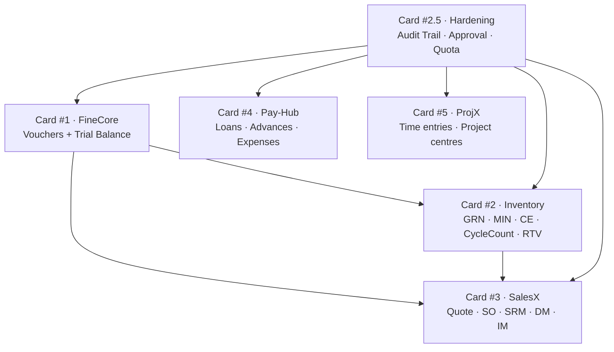
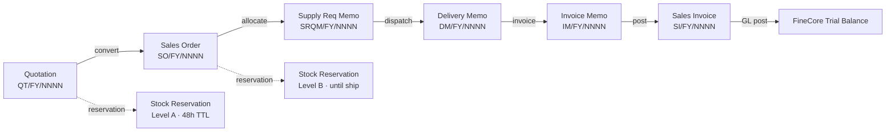
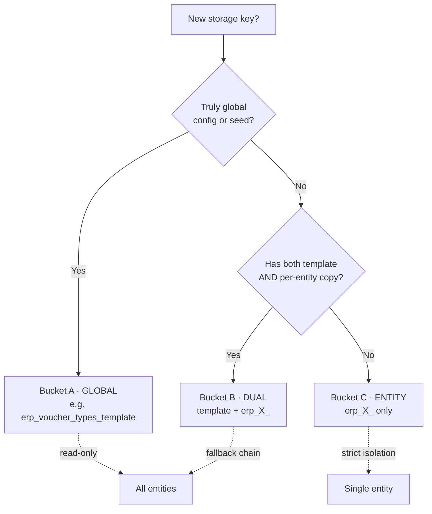
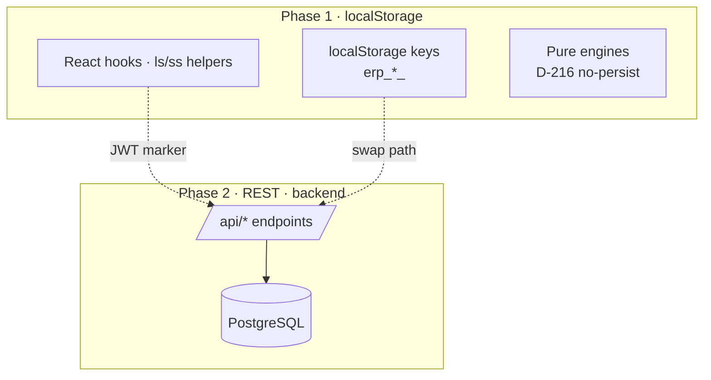

# 4DSmartOps Architecture · Sprint T-Phase-1.2.5h-c1

## Architectural Invariants

- **D-127** — `src/pages/erp/accounting/vouchers/` is ZERO TOUCH. Streak counter at **4** (h-a → h-b1 → h-b2 → h-c1).
- **D-128** — `src/types/voucher.ts` and `src/types/voucher-type.ts` BYTE-IDENTICAL across forks. Sibling fields permitted, never renames.
- **D-194** — Phase 1 is localStorage-only with `[JWT]` markers at every boundary. Phase 2 swaps to REST without changing call sites.
- **D-216** — Pure engines never persist. Caller decides whether to cache/store.
- **MCA Rule 3(1)** — Universal audit trail · cannot be disabled · 8-year retention.
- **CGST Rule 56(8)** — Edit/delete protection via voucher-version-engine (posted records become version N+1).
- **CGST Rule 56(12)** — Monthly Production Accounts report.

## 1. Card Dependency Graph



## 2. Voucher Data Flow (O2C)



## 3. Multi-Tenant Key Scoping (Bucket A/B/C)



## 4. Audit Trail Architecture (MCA Rule 3(1))

```mermaid
graph LR
  Caller[Hook/Page] --> Engine[approval-workflow-engine<br/>OR direct logAudit]
  Engine --> Audit[audit-trail-engine<br/>logAudit · ALWAYS WRITES]
  Audit --> Store[(localStorage<br/>erp_audit_trail_<entity>)]
  Audit -.bypass quota.-> Quota[storage-quota-engine<br/>audit_trail intent ALWAYS allowed]
  Store --> Report[AuditTrailReport · CSV export]
  Store --> Mpa[MonthlyProductionAccounts<br/>CGST Rule 56(12)]
```

## 5. Phase 1 vs Phase 2 Boundary



## Cross-Module FK Pattern

Foreign keys cross modules via human-readable codes (not UUIDs) to keep
localStorage compact and Phase 2 migration deterministic.

| Source | FK | Target |
|---|---|---|
| MIN | `to_godown_id` | godown master |
| GRN | `vendor_id` | party master |
| Voucher | `entity_code` | entity master |
| Audit Trail | `record_id` + `entity_type` | any record |
| Cycle Count | `superseded_by` | newer cycle count (CGST 56(8) chain) |

Every cross-module read uses entity-scoped storage keys (Bucket B/C) so
single-entity tenants never leak data across boundaries.
